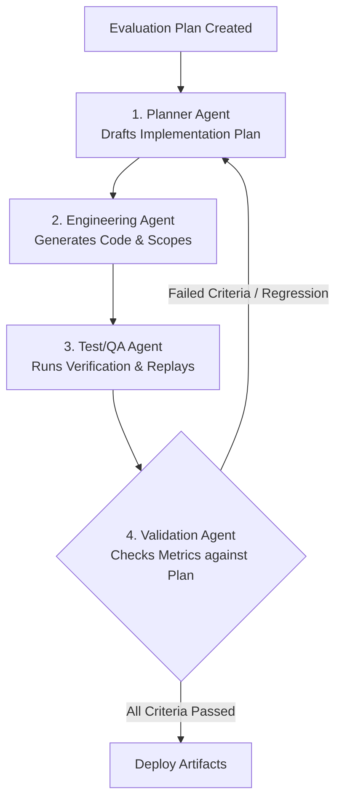

# Agentic Evaluation & Goal Design Skill

This skill provides a standardized framework for authoring **Goal & Evaluation Plans** (e.g., `EVALUATION-PLAN.md`). These plans act as the entry contract and validation gate for downstream automated loops (such as Codex, Claude, or sub-agent factories) to draft implementation plans, generate code, run tests, and verify deliverables.

---

## 1. Core Principles of Evaluation Design

To ensure an evaluation plan can be parsed and executed autonomously by downstream sub-agents in a loop, it must adhere to these four core design principles:

### I. Deterministic Scoping over Fuzzy Metrics
* **No Fuzzy Targets**: Avoid framing requirements around arbitrary percentage-based targets (e.g. "optimize latency by 50%" or "reduce cost by 30%").
* **Deterministic Rules**: Specify scoping rules as deterministic logic (e.g., "Conversational turns must completely exclude database schemas, guidelines, and MCP tools. Coding turns must only load schema definitions matching datasets listed in the active payload").

### II. Parity and Non-Inferiority Benchmarks
* **Non-Inferiority**: Since multi-model splits and orchestration loops introduce additional execution turns, frame token size and latency targets in terms of non-inferiority compared to the monolithic baseline.
* **Overhead Ceilings**: Allow for a strict, measurable overhead ceiling (e.g., "The combined token size and execution latency of the multi-model flow must not be materially more than the monolithic baseline, subject to a maximum 10% overhead ceiling").

### III. Immutable Prompt Constraint
* **Content/Logic Separation**: Always isolate prompt text from prompt assembly logic.
* **Hard Constraint**: Mandate that existing prompt strings, guidelines, and instruction blocks are treated as immutable (unmodified). Optimization must be achieved purely by selecting, scoping, or omitting these existing prompt components based on the mapped route, preventing semantic regressions in tested prompts.

### IV. Uniform Model Verification (Anti-Bias Rule)
* **Anti-Bias Verification**: To prevent implementing agents from claiming "savings" simply by downgrading to low-tier models (which sacrifices reasoning quality), the validation runbook must enforce a uniform baseline test.
* **Uniform Configuration**: The acceptance criteria must be proven with all environment variables configured to the **same high-grade model** (e.g., Claude 3.5 Sonnet) as used in the monolithic baseline.

---

## 2. Downstream Agentic Loop Integration

An evaluation plan serves as the source of truth for a multi-agent factory loop:

---

## 3. Plan Document Structure Template

When creating a new evaluation plan, use the following standard sections:

### Section 1: Objectives & Context
* Define the existing monolithic challenge.
* Outline the proposed specialized model split.
* Establish resource constraints (e.g., 12-hour engineering budget, in-process routing, zero external dependencies).

### Section 2: Resolved Design Decisions
* Explicitly declare known design decisions (classification strategy, fallback mechanics, env var mappings) to prevent the implementing agent from making false design assumptions.

### Section 3: Dedicated Model Roles Matrix
* Tabulate the preselected model roles (e.g., Reasoning/Coordination, Coding, Output) mapped to their corresponding configuration keys.

### Section 4: Deterministic Scoping Rules
* Tabulate which exact system prompts, schemas, files, and tools are allowed per role.
* Declare hard rules for context filtering and MCP tool registrations.

### Section 5: Acceptance Criteria (Parity & Non-Inferiority)
* **P0: Functional Parity**: Output contract integrity, schema validation safety, and 100% test suite success.
* **P0: Prompt Immutability**: Verification that prompt text strings remain unmodified.
* **P1: Token & Cost Non-Inferiority**: Scoping constraints met under uniform model configurations, with a maximum 10% overhead ceiling.
* **P1: Latency Non-Inferiority**: Wall-clock turn latency parity.

### Section 6: What Constitutes the "Happy State"
* Provide a clear, bulleted overview of a clean production codebase state (e.g., helper isolation, deterministic prompt builders, Langfuse telemetry spans).
* Include a model-agnostic visual comparison (Monolithic Baseline vs. Scoped Happy Path) showing injected content difference.

### Section 7: Engineer Validation Runbook
* Define a reproducible script-based verification runbook for the QA/Test agent to execute:
  1. Trajectory Replays (e.g., Scenario A to D).
  2. Telemetry and Token Measurement rules.
  3. Latency Verification commands.

---

## 4. Self-Audit Checklist for Evaluation Plans

Before finalizing an evaluation plan for the loop, ensure you can check off the following items:
- [ ] No fuzzy percentage savings targets exist in the primary metrics.
- [ ] The Anti-Bias rule (uniform baseline model configuration) is explicitly required in the runbook.
- [ ] The Immutable Prompt Constraint is clearly defined as a P0 constraint.
- [ ] Iteration caps or retry limits match monolithic parity instead of introducing new design constraints.
- [ ] Scoping guidelines are stated as deterministic lookup rules based on active datasets/routes.
