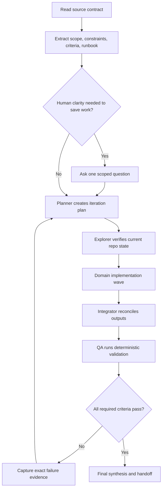

# Agentic Loop Templates

## Reusable Loop Graph



## Subagent Prompt Template

```markdown
Use the <agent-name> agent for this scoped task.

## Context
- Original request: <request>
- Source contract: <path>
- Target repos/services: <repos or services>
- Current iteration: <1, 2, ...>
- Decisions already made: <resolved decisions>
- Human clarification: <answer that shaped scope, or "not needed">
- Previous findings/failures: <exact evidence, or "none">

## Scope
- Allowed files/areas: <contract-derived allowlist>
- Blocked files/areas: <contract-derived denylist>
- Hard constraints: <must not violate>
- Stop conditions: <when to return instead of continuing>

## Task
<one domain-specific task>

## Required output
- Findings or changes made.
- Criteria supported.
- Tests or checks run.
- Remaining risks or follow-up needed.
```

## Final Synthesis Template

```markdown
## Agentic Loop Synthesis

### Contract
- Source: <path>
- Goal: <one sentence>
- Iterations: <count>

### Agents / Roles Used
| Role | Focus | Result |
| --- | --- | --- |
| Planner | <scope> | <result> |
| Explorer | <scope> | <result> |
| Implementation | <scope> | <result> |
| QA | <scope> | <result> |

### Changes
- <file or behavior changed>

### Verification
| Command / Check | Result | Evidence |
| --- | --- | --- |
| `<command>` | Pass/Fail/Skipped | <short evidence> |

### Acceptance Criteria
| Criterion | Status | Notes |
| --- | --- | --- |
| <P0/P1 item> | Pass/Fail/Blocked | <notes> |

### Risks / Blockers
- <unresolved risk, skipped check, or blocker>

### Outcome
<Complete, blocked, or next iteration target.>
```

## Security-Review Style Contract Checklist

Use this checklist when the source artifact resembles `planning/security-review/evaluations/*.md`:

- Objectives and threat/context are explicit.
- Resource constraints and scope boundaries are stated.
- Resolved design decisions are listed.
- Role matrix maps reasoning, coding, and QA responsibilities.
- Deterministic scoping rules include allowed file operations and hard constraints.
- Acceptance criteria distinguish P0 invariants from P1 quality or non-inferiority checks.
- Happy state includes a concrete expected flow, diagram, or end-state description.
- Engineer validation runbook contains executable commands, expected results, and cleanup steps.
- Implementation mapping is treated as current only after explorer verification against the checkout.
- Human clarification is requested only if it materially narrows repo targets, scope boundaries, credentials/access needs, or disputed product/security decisions.
